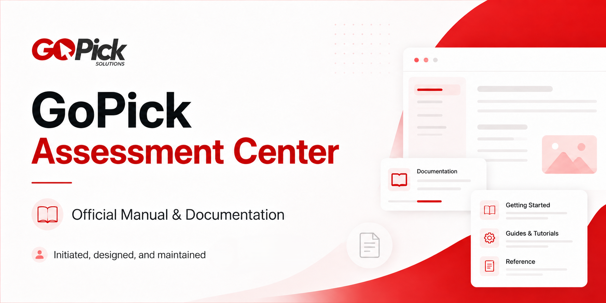

# GoPick Assessment Center Manual

GoPick Assessment Center Manual is a static documentation website for GoPick workflows, platform capabilities, domain rules, and documentation standards. The site is built with HTML, CSS, and browser JavaScript, with Tailwind CSS loaded from its CDN.

> NOTE
>
> The README banner and portions of the documentation cleanup were created with AI assistance and reviewed before inclusion. If any content is inaccurate, unclear, or needs adjustment, please submit a [Manual Correction request](https://github.com/PAP-PDI-IT-Team/gopick_manual/issues/new?template=manual-correction.md) so it can be reviewed and updated.

## What is documented

- Account, candidate, assessment, meter, report, resource-center, user, and role/permission workflows
- Dashboard and platform overview content
- Meter domain-governance rules
- Developer rules and manual-authoring guides
- Searchable navigation between manual pages and page sections

## Run locally

No application packages or build step are required.

### VS Code Five Server

1. Open this repository in Visual Studio Code.
2. Open **Extensions** and install **Five Server**.
3. Select **Go Live** in the VS Code status bar, or right-click `index.html` and select **Open with Five Server**.
4. Use the browser tab opened by Five Server to view the landing page.

### Manually Open From Directory
1. Open the root `index.html` file.
2. It will open the browser to view the landing page.

Five Server must serve the repository root because the landing page fetches `shared/data/gopick-data.json`.

### Open the file directly

You can also open the root `index.html` in a browser. Some browsers block local `fetch()` requests from `file://` pages, so the landing-page data may not load in this mode. Use Five Server when that occurs.

An internet connection is required for the Tailwind CSS CDN used by the pages.

## Repository structure

```text
.
|-- index.html                 Home-page shell
|-- CONTRIBUTING.md           Contribution use cases and review requirements
|-- assets/                    Home-page CSS and JavaScript
|-- shared/
|   |-- css/                   Shared site-shell styles
|   |-- data/                  Home-page content data
|   |-- img/                   Shared images and logo
|   `-- js/                    Shared loading, search, navigation, and UI code
|-- pages/
|   |-- workflow/              Rendered workflow manuals
|   |   `-- <page-name>/
|   |       |-- index.html     Page-specific HTML shell
|   |       `-- assets/
|   |           |-- css/       Page-specific layout, components, and styles
|   |           `-- js/        Page-specific content and behavior
|   |-- domain-governance/     Rendered domain-governance documentation
|   |   `-- <page-name>/       Page HTML with its own CSS and JavaScript assets
|   |-- guides/                Rendered documentation guides
|   |   `-- <page-name>/       Guide HTML with its own CSS and JavaScript assets
|   `-- dev-rules/             Rendered developer rules and local assets
`-- docs/
    |-- adr/                   Crucial architectural and documentation decisions
    |-- workflow/              Workflow Markdown sources
    |-- domain-governance/     Domain-governance Markdown sources
    |-- guides/                Documentation structure and authoring standards
    `-- old-version/           Changelogs archived during future version maintenance
```

## Content ownership

The repository keeps documentation meaning and browser presentation separate:

- `docs/**/*.md` is the source of documentation meaning.
- A rendered manual page uses its local `pages/**/index.html` as the structural shell.
- Each page directory owns an `assets/` directory for files used only by that page.
- Page-specific styling belongs in the local `assets/css/` directory. Depending on the page, this can include `style.css`, `layout.css`, `components.css`, or `table.css`.
- Page content and section hierarchy are usually defined in the local `assets/js/dataFiller.js`.
- Page interaction behavior usually belongs in the local `assets/js/behavior.js`. Specialized pages may include additional scripts such as renderers, sidebars, or table enhancements.
- Shared navigation, search, loading, and site-shell behavior belong under `shared/`.
- Home-page cards and metadata are loaded from `shared/data/gopick-data.json`.

When changing one page, begin with that page's local assets. Change files under `shared/` only when the behavior or presentation is intentionally shared by multiple pages.

The site does not parse Markdown at runtime. When documentation changes, update the corresponding Markdown source and deliberately synchronize its meaning with the rendered page data.

## Principles to use and consider

### Keep changes within the requested scope

Change only the page, content, or shared behavior explicitly included in the task. This is a legacy documentation site, so unrelated cleanup can unintentionally change existing navigation, content order, styling, or deep links.

### Use the correct content owner

Place each change at the narrowest owner responsible for it:

- Documentation meaning belongs in `docs/`.
- Page structure belongs in the page's `index.html`.
- Page content belongs in the page-local `assets/js/dataFiller.js`.
- Page behavior belongs in page-local JavaScript.
- Page presentation belongs in page-local CSS.
- Behavior and presentation intentionally used by multiple pages belong in `shared/`.

This separation keeps changes traceable and prevents page-specific requirements from affecting the entire site.

### Preserve one source of meaning

Do not copy the same explanation into multiple Markdown sections. Define shared behavior once and link to its owning section. The rendered page should synchronize with that source instead of creating a second interpretation. This reduces contradictory documentation and makes future updates predictable.

### Follow separation of concerns and single responsibility

Keep content data, rendering, interaction behavior, styling, and shared navigation in their existing owners. A file or function should have one clear responsibility. This makes legacy code easier to understand and reduces the number of files that must change for one behavior.

### Prefer simple, explicit implementations

Apply KISS and YAGNI: implement the current requirement without speculative abstractions, unused configuration, alternative flows, or compatibility paths that were not requested. Explicit inputs, paths, section IDs, and data shapes are easier to inspect and maintain than hidden conventions.

### Preserve stable navigation contracts

Treat page URLs, section IDs, sidebar order, and search targets as public documentation contracts. Change them only when explicitly required, and update every related link or alias together. This protects bookmarks, cross-page references, and direct hash navigation.

### Use clear, intention-revealing names

Use `camelCase` for variables and functions, `PascalCase` for classes, and `SNAKE_UPPER_CASE` for constants. Avoid generic or abbreviated names. Clear names show what content or behavior a value owns without requiring additional comments.

### Keep documentation evidence-based

Document only behavior verified from the current UI, navigation, repository source, or observed operation. Mark unresolved information with an appropriate Markdown TODO instead of presenting an assumption as fact. This keeps the manual trustworthy.

### Apply application layers only where they exist

This repository is a static website and does not currently contain controllers, services, repositories, or models. If application code is introduced or maintained elsewhere, preserve the five-layer flow: Controller for request orchestration, Service for use-case decisions, Repository for data access, Model for data contracts and validation, and View for presentation. Keeping those boundaries prevents business logic and data access from leaking into the UI.

## Updating a manual page

1. Read the relevant source under `docs/` and the current rendered page under `pages/`.
2. Follow `docs/guides/markdown-workflow-structure-standard.md` for workflow-document hierarchy.
3. Follow `docs/guides/manual-documentation-standard.md` for evidence, writing, and validation requirements.
4. Update the Markdown source of meaning.
5. Synchronize the matching page-local `assets/js/dataFiller.js` without moving content logic into HTML.
6. Preserve stable section IDs because sidebars, deep links, and global search depend on them.
7. Check the page from the local HTTP server at desktop and mobile widths, including direct hash links.

## Implementation notes

- This is a browser-only static site; there is no package manifest or automated build pipeline in the repository.
- The home page is data-driven through `shared/data/gopick-data.json` and the shared loader/binder modules.
- Most manual pages render their content dynamically from page-local JavaScript.
- `shared/js/headerSearch.js` provides cross-page search and maps results to page or section URLs.
- Relative asset paths depend on serving the repository root without changing its directory layout.

## Development and pull request process

See [CONTRIBUTING.md](CONTRIBUTING.md) for repository-specific contribution use cases, ownership rules, verification requirements, and pull request expectations.

### 1. Confirm the requested scope

Read `AGENTS.md`, `CODE_OF_CONDUCT.md`, and the applicable standards under `docs/guides/`. Identify the exact pages, documentation sources, assets, shared behavior, and navigation contracts included in the request. Do not include unrelated cleanup or unapproved architecture changes.

### 2. Verify the current owners

Inspect the current files before editing. Apply each change to its narrowest established owner:

- Documentation meaning: `docs/**/*.md`
- Rendered page structure: `pages/**/index.html`
- Page content: page-local `assets/js/dataFiller.js`
- Page behavior: page-local JavaScript
- Page presentation: page-local CSS
- Shared behavior and presentation: `shared/`
- Home-page content: `shared/data/gopick-data.json`
- Visual tokens and design decisions: `DESIGN.md`

When documentation meaning changes, synchronize the corresponding rendered page deliberately. Do not treat either representation as an optional copy.

### 3. Implement one explicit flow

Keep the change localized and complete within the touched scope. Preserve existing URLs, section IDs, search targets, relative asset paths, and script load order unless the request explicitly changes them. Do not add silent errors, hidden defaults, undeclared compatibility behavior, or legacy fallback paths.

When a versioned CSS or JavaScript file changes, update every applicable reference using the `?v=YYYYMMDD-description` convention.

### 4. Verify the result

Serve the repository root through a local static server and record the checks performed. As applicable, verify:

- Changed pages render at desktop and mobile widths.
- Direct page links and section hashes reach the intended content.
- Shared navigation and search still reach the changed documentation.
- Keyboard interaction, focus behavior, labels, alternative text, and ARIA state remain correct.
- Changed CSS and JavaScript pass the applicable lint or format check.
- Markdown sources and rendered page content remain synchronized.

Do not claim a check passed unless it was actually performed. Explain any required check that remains open.

### 5. Update the changelog

Every pull request merged into `main` is treated as materially released. A new pull request creates exactly one new semantic version and dated section in `CHANGELOG.md`; later changes in that same pull request update the same section. Put every notable human and AI-assisted change under the appropriate category: `Added`, `Changed`, `Deprecated`, `Removed`, `Fixed`, or `Security`.

When the pull request boundary cannot be detected reliably, append a verified `PR #number` to the version heading. If no PR number exists, use the first commit SHA that actually belongs to the PR. Do not use placeholders or unrelated commits.

The changelog records what changed. It does not replace a decision record when a crucial decision was made.

### 6. Record crucial decisions

When the pull request introduces or changes a crucial architectural, documentation, workflow, governance, or compatibility decision, add or update a record under `docs/adr/`.

Name a new record `NNN-abc.md`, where `NNN` is the next sequential three-digit number and `abc` is a three-letter lowercase scope. Follow `docs/adr/README.md` and record the status, date, scope, context, decision, and consequences. Routine corrections and implementation details do not require an ADR.

### 7. Prepare the pull request

Complete `.github/pull_request_template.md` with:

- A concise summary and explicit scope
- Verification commands, results, screenshots, or local URLs
- Confirmation of the pull request's semantic version, date, categorized entries, and PR identifier when required
- The ADR path or a clear statement that no crucial decision was made
- Known risks and explicitly scoped follow-up work

Do not mark conditional checks as completed when they were not applicable or not performed; explain their status in the pull request.

## Release and changelog archive process

Follow `docs/guides/changelog-versioning.md` when selecting a semantic version and preparing the changelog for release.

There is no `Unreleased` section in this repository. The pull request's dated version section is its release record and must be complete before merge. Keep the active `CHANGELOG.md` at the repository root.

Use `docs/old-version/` only during intentional version maintenance when an older changelog is deliberately archived. Give every archived file an explicit version-based filename, and do not silently copy or move the active changelog during an ordinary pull request.
